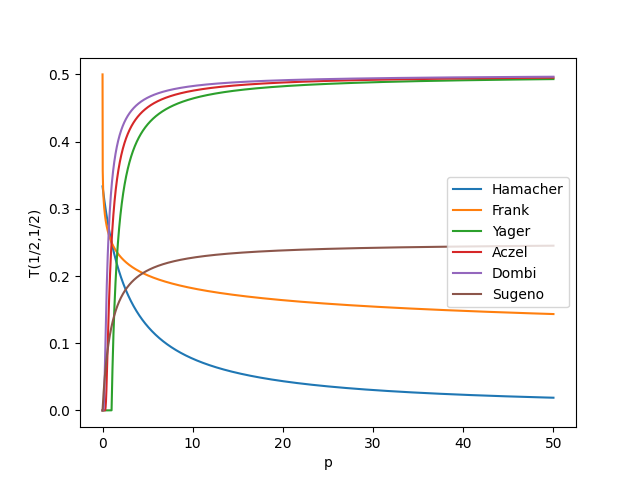

# t-norm
Collection of t-norms in Python

This is a work in progress.

Requirements:

numpy

References:

Reference image inspired by: https://citeseerx.ist.psu.edu/viewdoc/download?doi=10.1.1.149.2754&rep=rep1&type=pdf
https://en.wikipedia.org/wiki/T-norm
https://en.wikipedia.org/wiki/Construction_of_t-norms
